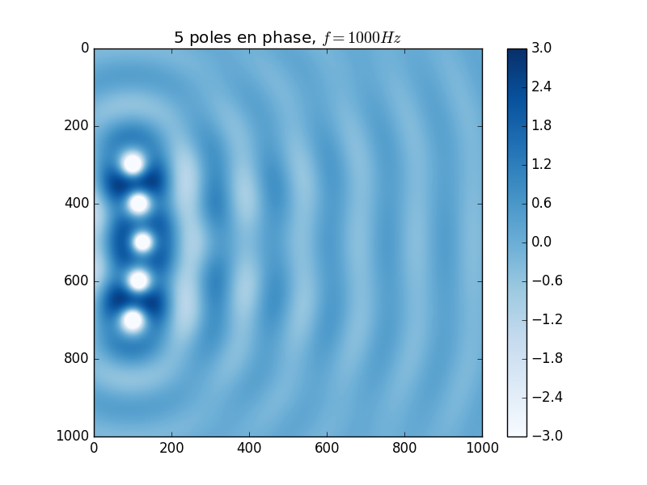
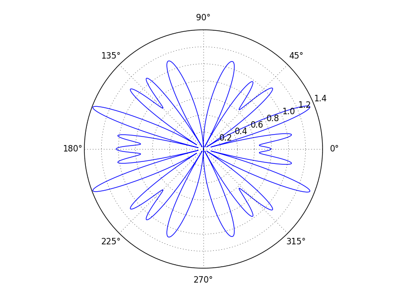

## Projet Acoustique MASTER SPI UPMC

But:
> Modéliser une antenne et étudier son rayonnement dans un plan 2D, représentée par un ensemble de monopoles.

>Le placement de plusieurs poles alignés permet la pseudo création d'une onde plane, sur un axe. Il faudrait voir si theoriquement on a une diminution de la perte en dB sur un doublement de distance. 

### Construction d'un diagramme polaire de directivité en fonction de sources

En combinant plusieurs monopoles ensemble, on peut construire des sources ayant une directivité proche de celles du monde réeelle.
On obtient par exemple ce genre de diagramme:

Application:
> Recréer les fiches techniques de systèmes d'antenne existant
