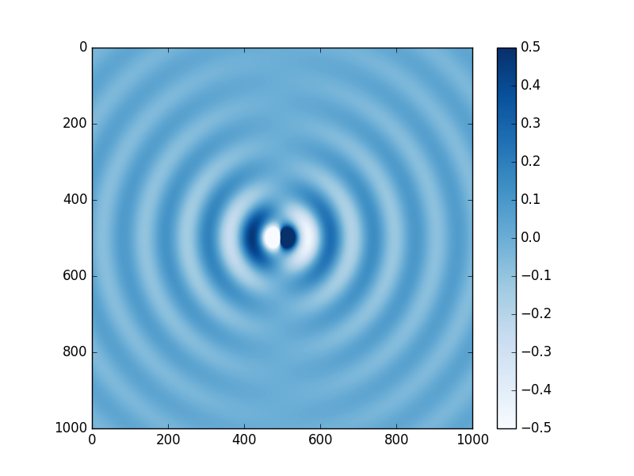
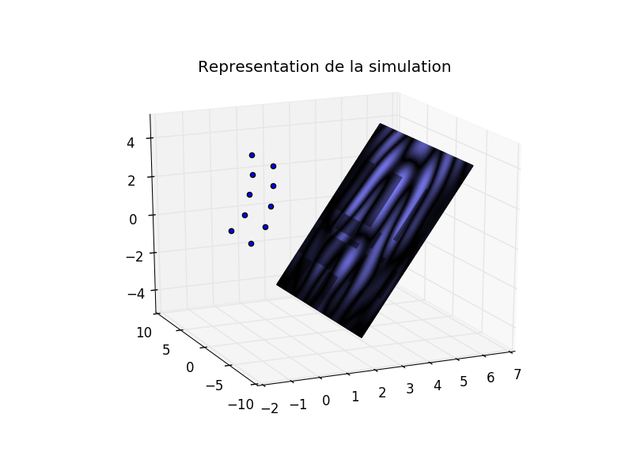
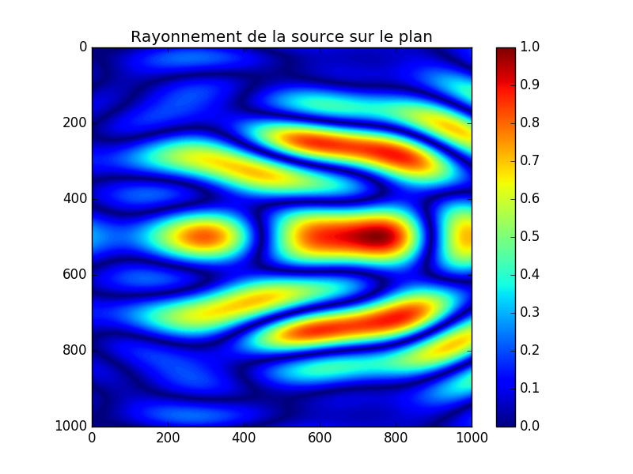

## Projet Acoustique MASTER SPI UPMC

But:
> Modéliser une antenne et étudier son rayonnement dans un plan 2D, représentée par un ensemble de monopoles.

> Modéliser dans l'espace le rayonnement d'une source constituée de monopoles considérés unidirectionels

Application:
> Recréer les fiches techniques de systèmes d'antenne existant
