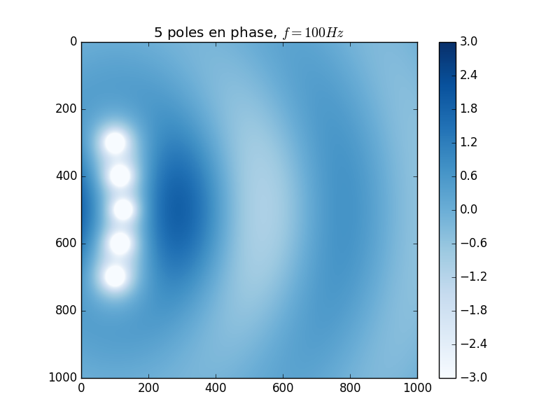
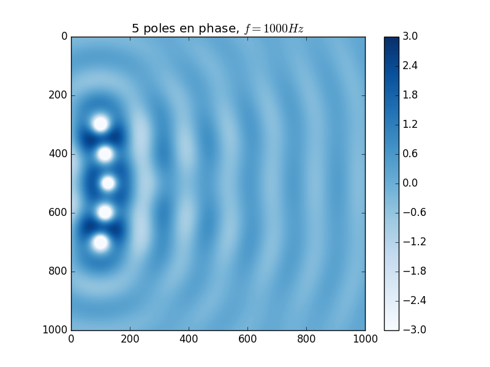

## Projet Acoustique MASTER SPI UPMC

But:
> Modéliser une antenne et étudier son rayonnement dans un plan 2D, représentée par un ensemble de monopoles.

Application:
> Recréer les fiches techniques des systèmes d'antenne existant
