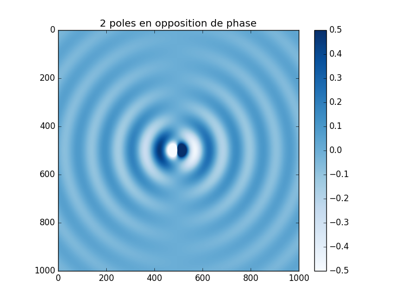
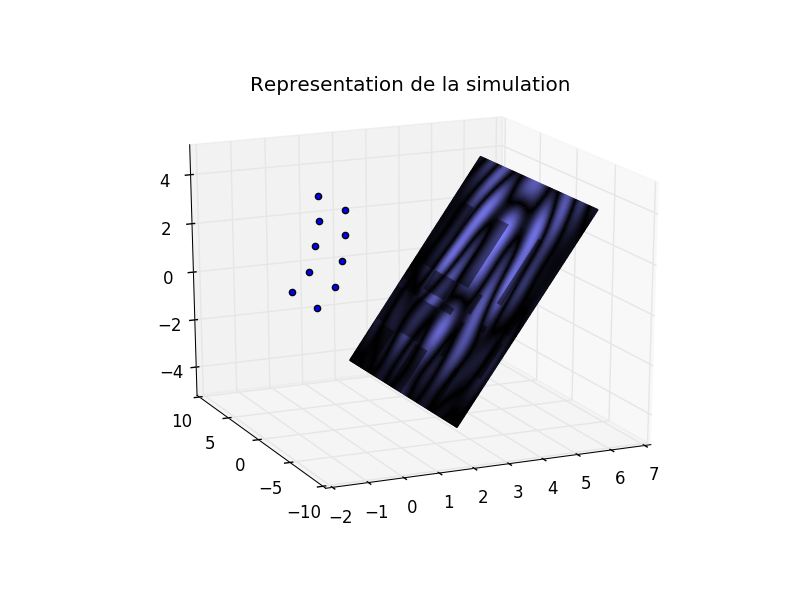
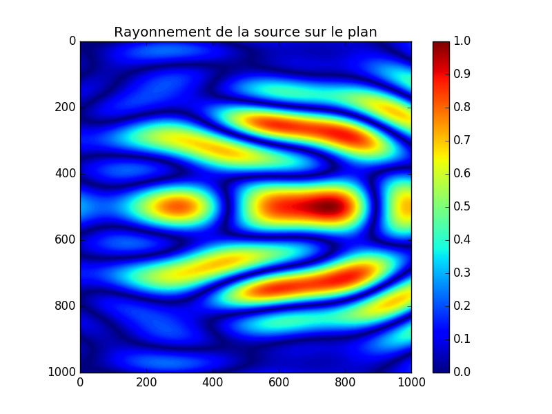

## Projet Acoustique MASTER SPI UPMC

But:
> Modéliser une antenne et étudier son rayonnement dans un plan 2D, représentée par un ensemble de monopoles.

>Le placement de plusieurs poles alignés permet la pseudo création d'une onde plane, sur un axe. Il faudrait voir si theoriquement on a une diminution de la perte en dB sur un doublement de distance. 

![reconstruction d'une onde plane](fig/f1000.png

> Modéliser dans l'espace le rayonnement d'une source constituée de monopoles considérés unidirectionels

Application:
> Recréer les fiches techniques de systèmes d'antenne existant
